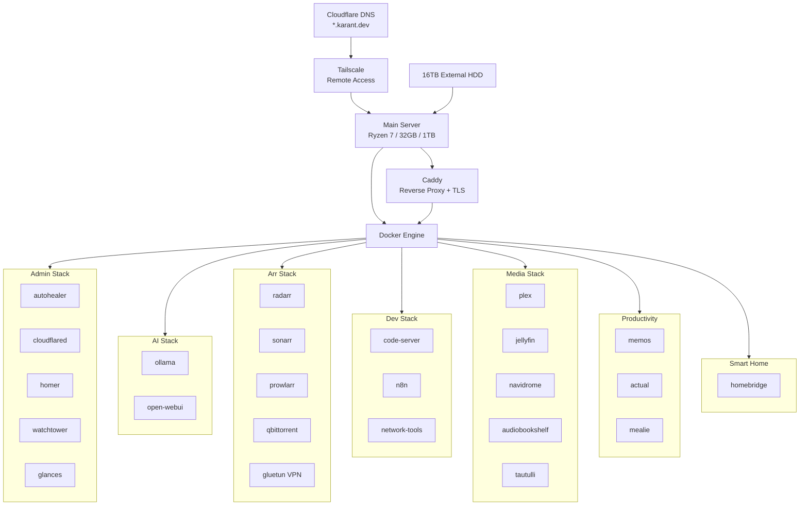

# Homelab

> **Note:** Evolving homelab. README might be slightly behind actual state.

## What is this?

Personal homelab setup — reusable Docker-based template for Debian/Ubuntu hosts. Sections below document architecture, services, and operational scripts.

---

## Quick Start

```bash
git clone https://github.com/karant-dev/homelab.git
cd homelab
cp .env.example .env
# edit .env with your domain + secrets
./install.sh
./up.sh
```

Start only selected stacks:

```bash
./up.sh admin media dev
```

Stop all or selected stacks:

```bash
./down.sh
./down.sh media arr
```

---

## Repository Layout

```text
.
├── configs/
│   ├── Caddyfile
│   ├── Caddyfile.template
│   ├── homer.yml
│   └── homer.yml.template
├── docker-compose/
│   ├── admin-stack.yml
│   ├── ai-stack.yml
│   ├── arr-stack.yml
│   ├── dev-stack.yml
│   ├── home-stack.yml
│   ├── media-stack.yml
│   ├── productivity-stack.yml
│   └── smarthome-stack.yml
├── scripts/
│   └── render-configs.sh
├── .env.example
├── install.sh
├── up.sh
└── down.sh
```

---

## Architecture



**Host-level components:** Docker Engine, Docker Compose plugin, Caddy, Tailscale.  
**App components:** Independent Docker Compose stacks under `docker-compose/`.  
**Shared config:** `.env` + runtime templating (`envsubst`) for Caddy + Homer configs.  
**Orchestration:** `up.sh` / `down.sh` run all stacks or a selected subset.

---

## Hardware

- `MAIN_SERVER` — Bosgame M4 (Ryzen 7 6800H, 32GB DDR5 RAM, 1TB SSD)
- `STORAGE` — 16TB Seagate External HDD

---

## Software & Services

### System-level

- **Caddy:** Web server with automatic HTTPS. Installed system-wide as reverse proxy. Handles routing for internal ports. Caddyfile at `configs/Caddyfile`. Built with Cloudflare DNS plugin for ACME DNS challenges.
- **Docker & Docker Compose:** Containerization platform. Compose files in `docker-compose/`.
- **Tailscale:** Secure tailnet for remote homelab access.

### Docker Stacks

**admin-stack (`admin-stack.yml`)**
- `autohealer` — Automated container restart utility
- `cloudflared` — Cloudflare tunnel daemon
- `dockerproxy` — Secure Docker socket proxy
- `glances` — System monitoring
- `homer` — Static service dashboard
- `watchtower` — Automated container image updates
- `wud` — Container update notifier

**ai-stack (`ai-stack.yml`)**
- `ollama` — Local LLM runner
- `open-webui` — Web UI for local LLMs

**arr-stack (`arr-stack.yml`)**
- `bazarr` — Subtitle manager
- `bookshelf` — Book tracking
- `flaresolverr` — Captcha bypass proxy
- `gluetun` — VPN client for network routing
- `lidarr` — Music collection manager
- `profilarr` — Radarr/Sonarr profile sync
- `prowlarr` — Indexer manager
- `qbittorrent` — Torrent client
- `radarr` — Movie collection manager
- `seerr` — Media request management
- `sonarr` — TV show collection manager

**dev-stack (`dev-stack.yml`)**
- `code-server` — Web-based VS Code
- `ittools` — Developer utility collection
- `n8n` — Workflow automation
- `network-tools` — Networking troubleshooter

**home-stack (`home-stack.yml`)**
- `actual-server` — Local personal finance
- `mealie` — Recipe and meal management

**media-stack (`media-stack.yml`)**
- `audiobookshelf` — Audiobook and podcast server
- `copyparty` — Web-based file manager/sharing
- `filebrowser` — Web-based file manager
- `iSponsorBlockTV` — SponsorBlock for TV apps
- `jellyfin` — Media server
- `jellyplex-watched` — Plex/Jellyfin watched sync
- `metube` — YouTube downloader
- `musicgrabber` — Music downloader
- `navidrome` — Music server
- `plex` — Primary video streaming server
- `romm` — Retro ROM manager
- `tautulli` — Plex analytics
- `tracearr` — Media monitoring (Plex + Jellyfin + Emby)

**productivity-stack (`productivity-stack.yml`)**
- `beaverhabits` — Habit tracker
- `bentopdf` — PDF editor
- `karakeep` + `karakeep-chrome` + `karakeep-meilisearch` — Data management + deps
- `memos` — Lightweight note-taking

**smarthome-stack (`smarthome-stack.yml`)**
- `homebridge` — HomeKit integration for unsupported devices

**Standalone**
- `portainer` — Container management GUI

---

## Compose Strategy

Multiple compose files + orchestration scripts, not one monolithic file.

- Partial workloads easy: `./up.sh media dev`
- Low blast radius: stacks restart independently
- More readable for homelab use

Tradeoff: cross-stack dependencies managed operationally (script order) rather than in a single Compose model.

---

## Configuration (`.env`)

Required values:

- `DOMAIN` → base domain (e.g. `karant.dev`)
- `DATA_ROOT` → persistent app data root
- `MEDIA_ROOT` → media mount root
- `CLOUDFLARE_API_TOKEN` → Caddy DNS challenge
- `CLOUDFLARE_TUNNEL_TOKEN` → cloudflared container
- `TAILSCALE_AUTH_KEY` → host Tailscale bootstrap key

After editing `.env`, render config templates:

```bash
./scripts/render-configs.sh
```

Outputs:
- `configs/Caddyfile`
- `configs/homer/config.yml`

If `DOMAIN` changes, re-run render script and reload Caddy.

---

## Install Flow (`install.sh`)

Idempotent — safe to re-run.

1. Install prerequisites (`curl`, `gnupg`, `gettext-base`, etc.)
2. Install Docker Engine + Compose plugin if missing
3. Enable/start Docker service
4. Create required directories from `.env` paths
5. Add current user to `docker` group if needed
6. Sanity checks (free disk, ports 80/443)
7. Render templated configs

---

## DNS & Routing

- A records point to homelab Tailnet IP
- Subdomains route to services via Caddyfile
- Caddy handles TLS dynamically via ACME/Cloudflare DNS

---

## Passwords & Keys

Not stored in this repo.

- Use a password manager (e.g. Bitwarden); inject into host environment
- Never commit real values in `.env`
- Some services require manual post-setup API key config in their UIs

---

## Known Limitations

- Homelab template, not hardened production baseline
- VPN-dependent workloads (arr-stack) need valid provider credentials
- Port collisions possible if host already runs other services
- Host-level Caddy/Tailscale install details vary by distro — minimally opinionated here
